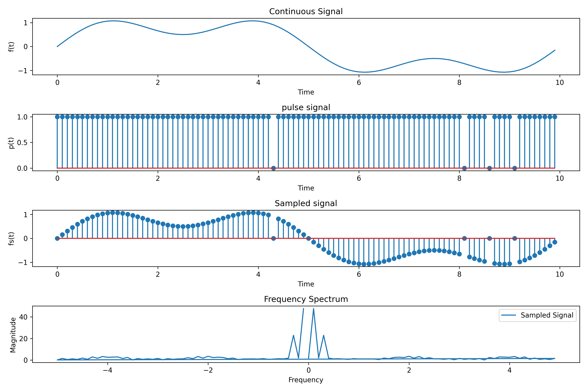

# 理想抽样（周期单位冲激抽样）的傅里叶变换可视化

## 目标

实现拖动滑块改变周期和采样频率，做出理想抽样的傅里叶变换随之改变的效果

## 文件说明

- `run.py`是具体代码，演示了随着滑块拖动改变周期和采样频率，理想抽样的傅里叶变换随之改变的效果；

- `demo.ipynb`演示了给定某一周期和采样频率的理想抽样的傅里叶变换；

- `requirements.txt`是所需的依赖库；

- `呈现效果.gif`是对作业演示截的动图。

运行前，安装所需库

```python
!pip install -r requirements.txt
```

## 具体思路

1. 生成一个模拟信号，这里生成的是 $f(t)=sin(0.2\pi t)+0.5*sin(0.6\pi t)$

    ```python
    # 定义连续信号 f(t)
    def continuous_signal(t):
        return np.sin(2 * np.pi * 0.1*t) + 0.5 * np.sin(6 * np.pi * 0.1*t)

    # 生成连续信号
    f = continuous_signal(t)
    ```

2. 生成周期单位冲激信号，用作抽样

    ```python
    # 周期单位冲激脉冲序列 p(t)
    def dirac_pulse(t, Ts):
        return np.where(np.abs((t / Ts) % 1) < 1e-10, 1, 0)

    # 计算周期单位冲激脉冲序列
    p = dirac_pulse(t, Ts)
    ```

3. 进行抽样，计算抽样后的序列

    ```python
    # 计算抽样后信号
    fs = f * p
    ```

4. 生成时间序列，这里设置为10s

    ```python
    t = np.arange(0, 10, Ts)
    ```

5. 计算抽样后序列的傅里叶变换(采用FFT)

    ```python
    # 计算信号的傅里叶变换(采用FFT)
    def fourier_transform(signal, t):
        dt = t[1] - t[0]
        N = len(t)
        frequency = np.fft.fftfreq(N, dt)
        spectrum = np.fft.fft(signal)
        return frequency, spectrum

    # 计算抽样后序列的傅里叶变换
    frequency_fs, spectrum_fs = fourier_transform(fs, t)    
    ```

6. 设置固定的抽样周期和频率，进行可视化

    ```python
    # 设置抽样参数
    Ts = 0.1  # 抽样周期
    fs = 1 / Ts  # 抽样频率

    plt.figure(figsize=(12, 8))

    plt.subplot(4, 1, 1)
    plt.plot(t, f)
    plt.xlabel('Time')
    plt.ylabel('f(t)')
    plt.title('Continuous Signal')

    plt.subplot(4, 1, 2)
    plt.stem(t, p)
    plt.xlabel('Time')
    plt.ylabel('p(t)')
    plt.title('pulse signal')

    plt.subplot(4, 1, 3)
    plt.stem(t, fs)
    plt.xlabel('Time')
    plt.ylabel('fs(t)')
    plt.title('Sampled signal')

    plt.subplot(4, 1, 4)
    plt.plot(frequency_fs, np.abs(spectrum_fs))
    plt.xlabel('Frequency')
    plt.ylabel('Magnitude')
    plt.legend(['Sampled Signal'])
    plt.title('Frequency Spectrum')
    plt.tight_layout()
    plt.show()
    ```

    

7. 加入动画，用滑块控制抽样周期和频率的变换

    ```python
    # 图形化界面
    def update(val):
        Ts = slider.val
        t = np.arange(0, 10, Ts)

        f = continuous_signal(t)
        p = dirac_pulse(t, Ts)
        fs = f * p

        frequency_fs, spectrum_fs = fourier_transform(fs, t)

        ax1.clear()
        ax1.plot(t, f)
        ax1.set_xlabel('Time')
        ax1.set_ylabel('f(t)')
        ax1.set_title('Continuous Signal')

        ax2.clear()
        ax2.stem(t, p)
        ax2.set_xlabel('Time')
        ax2.set_ylabel('p(t)')
        ax2.set_title('Pulse Signal')

        ax3.clear()
        ax3.stem(t, fs)
        ax3.set_xlabel('Time')
        ax3.set_ylabel('fs(t)')
        ax3.set_title('Sampled Signal')

        ax4.clear()
        ax4.plot(frequency_fs, np.abs(spectrum_fs))
        ax4.set_xlabel('Frequency')
        ax4.set_ylabel('Magnitude')
        ax4.legend(['Sampled Signal'])
        ax4.set_title('Frequency Spectrum')

        plt.tight_layout()
        plt.draw()

    # Set up the initial parameters
    Ts_init = 0.1

    # Create the main figure
    fig, ((ax1, ax2), (ax3, ax4)) = plt.subplots(2, 2, figsize=(12, 8))
    plt.subplots_adjust(left=0.1, bottom=0.25)

    # Create a slider axis
    ax_slider = plt.axes([0.25, 0.1, 0.65, 0.03], facecolor='lightgoldenrodyellow')
    slider = Slider(ax_slider, 'Sampling Period (Ts)', 0.01, 1.0, valinit=Ts_init)

    # Attach the update function to the slider
    slider.on_changed(update)

    # Initialize the plots
    update(Ts_init)

    plt.show()
    ```

    